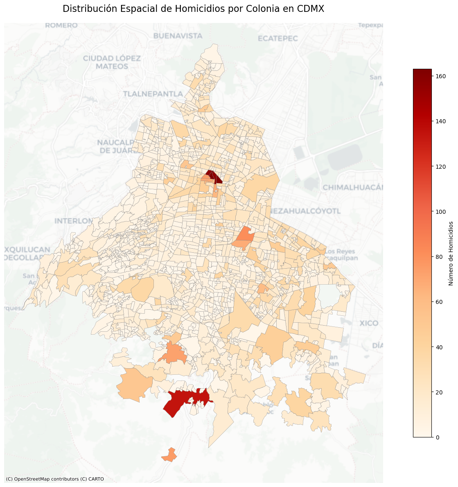
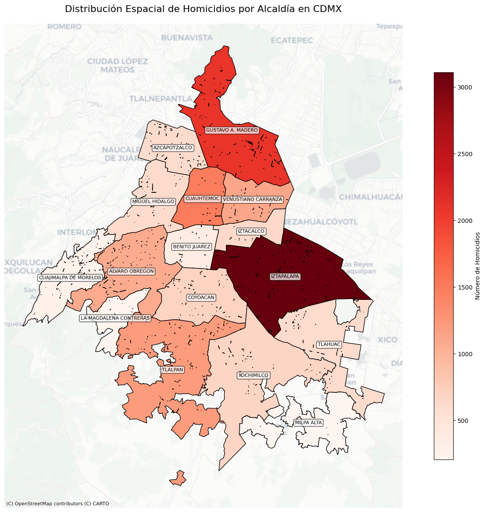
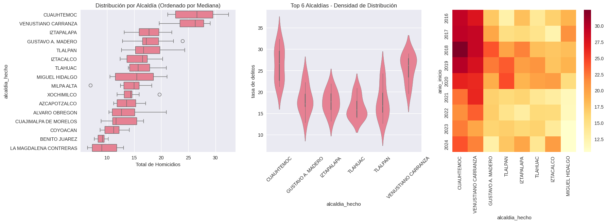

#Análisis No Paramétrico de homicidios en la Ciudad de México por
alcaldía 2019-2024. David Adonnay Jiménez Bazaldúa1

División de Ciencias Forestales, Universidad Autónoma Chapingo, México.
1 Departamento de Estadística Matemática y Computo, UACh.
[al21116565\@chapingo.mx](mailto:al21116565@chapingo.mx){.email}

INTRODUCCIÓN

La seguridad se erige como uno de los ejes primordiales y de mayor
interés en el colectivo mundial pues es un tema de máxima atención en el
desarrollo organizacional de todos los países del mundo, tanto así que,
para las Naciones Unidas, el tema de la seguridad, paz y justicia es un
objetivo rector en la agenda 2030 de los objetivos de desarrollo
sostenible pues pretende promover sociedades pacíficas e inclusivas, […]
y facilitar el acceso a la justicia para toda la población, priorizando
que todas las personas de todo el mundo vivan libres del miedo a
cualquier forma de violencia y se sientan seguras en su día a día, sea
cual sea su origen étnico, religión u orientación sexual (ONU, 2015).
Sin embargo, en el contexto mexicano, estas metas se enfrentan a una
realidad adversa: la violencia y el crimen organizado continúan siendo
fenómenos persistentes que afectan significativamente la calidad de vida
de la población ya que, pese a que el Estado afirma jurídicamente su
capacidad de competencia en el rubro de la seguridad mediante facultades
constitucionales (Art. 21 CEPEUM), datos recientes de INEGI (ENVIPE,
2024) señalan que en 2023, 27.5% de los hogares del país contó con al
menos un integrante víctima de delito (38.6 millones de hogares
estimados), cifra que ha prevalecido en los últimos años con récords que
llegan hasta un 35,6% en 2017 (Osorio, 2023) y con un promedio de 22.75
millones de víctimas de delito por año desde el 2012 hasta el 2023 con
una tasa de incidencia delictiva que se ubica (para el 2023) en 23.3 mil
víctimas por cada 100,000 habitantes. Además, la tasa de delitos por
cada 100 000 habitantes de 18 años y más en 2023 llego a un total de
33,267 (ENVIPE, 2024), con la Ciudad de México ubicándose muy por encima
de la media nacional con 52,723 delitos por cada 100,000 habitantes
ocupando el lugar número 1 en este ramo a nivel nacional. Para efectos
de la presente investigación se decidió centrar nuestra atención en el
homicidio el cual representa el delito de mayor gravedad al atentar
directamente contra el derecho fundamental a la vida. En citas de INEGI
(2015) se tiene que “Mientras en 1990 se reportó una tasa de 16.6 por
cada cien mil habitantes y en 2007 se tuvo un mínimo histórico de 8.1;
en 2017, la tasa de homicidios alcanzó la cifra de 26 homicidios por
cada cien mil habitantes, marcando con ello un récord histórico en el
periodo”, además, México ha sido identificado como uno de los países más
afectados por el crimen organizado, con cerca de un millón de muertes
atribuibles a este fenómeno entre 2000 y 2017 (UNODC, 2019). Dada la
relevancia social del fenómeno, el presente estudio se enfoca en el
análisis no paramétrico de los homicidios en las alcaldías de la Ciudad
de México. A través del uso de pruebas de comparación de medias y
medianas y herramientas de análisis geoespacial, se busca identificar
dinámicas de concentración, evolución en el tiempo y posibles factores
asociados al comportamiento de este tipo de delito.

ÁREA DE ESTUDIO

El área de estudio destinada para la presente investigación fue la
Ciudad de México, capital del país, con coordenadas Longitud:
99°21'53.64" W 98°56'25.08" W, Latitud: 19°02'53.52" N 19°35'34.08" N y
una superficie total de 1,494 kilómetros cuadrados dividida en 16
demarcaciones territoriales (alcaldías) y 1,812 colonias respectivamente
con una población de 9,209,944 habitantes reportados en el último censo
de 2020 (Secretaria de Economía, 2024) y con la mayor importancia
económica del país siendo el principal aportador al PIB nacional (INEGI,
2023).

Por cuanto a homicidios en la Ciudad de México se tiene registro de 743
casos para el 2023 (90 mujeres y 653 hombres), con un récord histórico
de 1,449 casos en 2018 (Osorio, 2022) y con un promedio de 1,152
homicidios para el periodo de interés considerado de 2016 hasta 2023.
Respecto a las alcaldías con mayor número de homicidios destaca
Iztapalapa con un total de 155 (139 hombres y 16 mujeres), seguido de
Gustavo A. Madero con 121 (102 hombres y 19 mujeres) y Venustiano
Carranza con 75 (68 hombres y 7 mujeres). Ponderado por población, la
alcaldía Venustiano Carranza presentó la mayor tasa de homicidios (17
por 100,000 habitantes), seguido de la alcaldía Miguel Hidalgo (14.4 por
100,000 habitantes). El lugar de ocurrencia de homicidios tanto para
mujeres como hombres fue la vía pública con un 22.2% y 41.5%
respectivamente, mientras que los rangos de edad más afectados por este
delito fueron 25-29 años para mujeres (14.4%) mientras que para hombres
fue el rango de edad comprendido por 35-39 años (15.6%).

ANÁLISIS INICIAL

El presente estudio utilizó datos obtenidos directamente de la Fiscalía
General de Justicia de la Ciudad de México (FGJ) quien es la unidad
administrativa encargada de la procuración de justicia en el lugar antes
mencionado. Respecto a los registros, la base de datos contiene la
información actualizada de las carpetas de investigación de la Fiscalía
General de Justicia de la Ciudad de México a partir de enero de 2016
hasta 2025. Las variables contenidas en la base son, Carpetas de
investigación de delitos a nivel de calle de la FGJ por Fiscalía,
Agencia, Unidad de Investigación, fecha de apertura de la carpeta de
investigación, delito, categoría de delito, calle, colonia, alcaldía,
coordenadas geográficas del hecho, mes y año.

La base de datos en cuestión contiene un total de 2,098,743 registros
concernientes a delitos ocurridos en la Ciudad de México en el periodo
de interés, sin embargo, una vez que se filtra solo la información
necesaria tenemos un total de 13,854 homicidios ocurridos1 entre el 01
de enero de 2016 al 31 de enero del 2025.

Este último dato no incluye a la tentativa de homicidio ni a homicidios
sin georreferencia (latitud, longitud), ya que de lo contrario se
dispone de un total de 17,501 registros, dado que la naturaleza de la
tentativa en particular no puede ser absoluta a un único factor y por
tanto se decidió desechar al igual que aquellos delitos sin
georreferencia dado que aumentan el sesgo espacial por tanto se trabajó
solo con delitos de homicidio materializados. Se realizó una
distribución espacial de los homicidios seccionando el área geográfica
por colonia (1812 en total) en donde se encontró que, para el periodo de
interés, son 1533 las colonias presentan por lo menos un homicidio.

Fuente: Elaboración propia con datos de la FGJ de la Ciudad de México y
la demarcación territorial oficial por colonias de la CDMX.

Del mismo modo se efectuó el mismo análisis espacial pero ahora
seccionando por alcaldía como se muestra a continuación.

Esta distribución espacial nos ayuda a identificar hotspots y coldspots
para identificar zonas de mayor riesgo, sin embargo, es necesario
desentrañar esta información hasta su forma más comprensible para lo
cual se reestructuró el mapa anterior por años presentando el cambio
evolutivo en la cantidad de homicidios y evidenciando la variable
temporal que es objeto primordial de estudio del presente.

Respectivamente se encontró que el número de homicidios por año posee la
forma siguiente: AÑO NUMERO DE HOMICIDIOS 2016 1420 2017 1512 2018 1792
2019 1805 2020 1609 2021 1361 2022 1337 2023 1377 2024 1543 2025 98
TOTAL 13,854 METODOLOGÍA

Se empleó una base de datos depurada compuesta por 144 observaciones
correspondientes a las tasas anuales de homicidios (por cada 100,000
habitantes) registradas en cada una de las 16 alcaldías de la Ciudad de
México, para los años comprendidos entre 2016 y 2024. El
preprocesamiento incluyó: Validación estructural del dataframe,
conversión de tasas a valores numéricos consistentes, eliminación de
valores fuera del rango temporal (2025 ya que al no disponer de mas
información se percibía como un outlier) y de entradas nulas o mal
codificadas.

Para determinar la idoneidad del uso de modelos paramétricos, se
aplicaron pruebas a nivel de grupo (por alcaldía) como lo es
Shapiro-Wilk y Jarque-Bera, con el objetivo de evaluar la normalidad de
las tasas anuales de homicidio ademas se incluye prueba de Levene, para
evaluar la homogeneidad de varianzas entre grupos. El rechazo de la
homocedasticidad (p \< 0.001) y la evidencia de distribuciones no
normales en múltiples alcaldías justificaron el uso de pruebas no
paramétricas.

Para evaluar la existencia de diferencias significativas entre las
distribuciones de las tasas de homicidio en distintas alcaldías, se
aplicó la prueba de Kruskal-Wallis H, equivalente no paramétrico de
ANOVA de un factor de manera que esta prueba clasifica todas las
observaciones según sus rangos globales y compara los rangos medios por
grupo. El estadístico H se calcula como:

PRUEBAS NO PARAMETRICAS

Test de Kruskal-Wallis

El test de Kruskal-Wallis es la alternativa no paramétrica al ANOVA de
una vía, evaluando si muestras independientes provienen de la misma
distribución.

Fundamento Matemático El estadístico H se calcula como:

$$H = \frac{12}{N(N+1)} \sum_{i=1}^{k} n_i(\bar{R_i} - \bar{R})$$

Donde N es el número total de observaciones, k es el número de grupos
(alcaldías), ni es el tamaño de cada grupo, Ri es el rango medio del
grupo y R el rango medio global. La prueba arrojó un valor de H =
97.5493 con df = 15, y un p-value menor a 0.000001, indicando
diferencias altamente significativas. Además, se estimó el tamaño del
efecto mediante el valor eta-cuadrado (η²) de Kruskal-Wallis como una
medida estadística que indica qué proporción de la varianza total en los
datos se debe a las diferencias entre grupos, en donde se ponderó un
efecto η² \< 0.01 como despreciable, η² \< 0.06 como pequeño, η² \< 0.14
como mediano y finalmente un valor η² \> 0.14 como grande. El
estadístico η² se calcula como:

$$\eta^2 = \dfrac{H -k + 1}{N - k}$$

Obteniéndose η² = 0.6449, lo que indica un efecto de magnitud grande
Para identificar las alcaldías responsables de las diferencias
encontradas, se realizaron pruebas de Mann–Whitney U por pares de
alcaldías (total de 120 comparaciones). Se aplicó corrección de
Bonferroni para controlar el error tipo I:

$$\alpha_{ajustado} = \dfrac{\alpha}{m} = \dfrac{0.05}{120} \approx 0.000417$$

Se reportaron 28 comparaciones significativas (74 antes de aplicar la
corrección Bonferroni), es decir un 23.33%. Para cada par, se calculó el
tamaño del efecto mediante:

$$r = \dfrac{Z}{\sqrt{n_1 + n_2}}$$

donde Z es el valor normalizado de la U obtenida. Valores se
consideraron de gran magnitud según Cohen. Dado que las tasas de
homicidio están organizadas temporalmente (por año), se aplicó la prueba
de Friedman la cual es adecuada para datos emparejados longitudinales
como en este caso ya que se disponen de 9 años para cada alcaldia. La
prueba de Friedman es descrita por:

$$X^2_F = \dfrac{12}{nk(k + 1)} \sum_j R^2_j - 3n(k+1)$$

Donde el numero de bloques n = 16 alcaldias y k = 9 años. Bajo la
hipótesis nula donde NO hay diferencia significativa entre los años, la
prueba reveló diferencias significativas en la distribución temporal de
homicidios entre alcaldías con un valor X² = 103.7647, sugiriendo
patrones divergentes de comportamiento a lo largo del tiempo. Para
detectar tendencias generales en el tiempo, se calcularon los
coeficientes de correlación de: Spearman (ρ = -0.1708, p = 0.040660) y
Kendall (τ = -0.1156, p = 0.050244). Ambos resultados indicaron
correlaciones temporales muy débiles y no significativas, lo cual
sugiere una ausencia de tendencia temporal global uniforme en las tasas
de homicidio ademas se encuentra ligera disminución en tasas de
homicidios para el periodo de interés. Finalmente la tasa (promedio) de
homicidios por cada 100,000 personas por alcaldía en la ciudad de México
presenta la siguiente comparativa.

Esta metodología garantiza la solidez estadística del análisis,
priorizando la validez de las inferencias incluso ante distribuciones no
normales, alta heterogeneidad entre grupos y presencia de valores
atípicos. El enfoque es extensible a otros delitos, y sienta una base
formal para atención prioritaria en materia de seguridad en el lugar de
estudio antes referido.

BIBLIOGRAFIA

Gobierno de la Ciudad de México, Base de datos sobre víctimas de los
delitos en las carpetas de investigación de la Fiscalía General de
Justicia (FGJ) de la Ciudad de México. Recuperado de
<https://datos.cdmx.gob.mx/dataset/carpetas-de-investigacion-fgj-de-la-ciudad-de-mexico>

Organización de las Naciones Unidas, 2015. Proyecto de resolución
remitido a la Cumbre de las Naciones Unidas para la aprobación de la
Agenda para el Desarrollo de 2015 por la Asamblea General en su
sexagésimo noveno periodo de sesiones. Nueva York

United Nacion Office on Drugs and Crime, 2019. Global Study on Homicide.
United Nacions, Vienna.

Constitución Política de los Estados Unidos Mexicanos (CPEUM), publicada
en el Diario Oficial de la Federación el 5 de febrero de 1917. México.

Código Nacional de Procedimientos Penales (CNPP), publicado en el Diario
Oficial de la Federación el 5 de marzo de 2014. México.

Instituto Nacional de Estadística y Geografía, 2015. PATRONES Y
TENDENCIAS DE LOS HOMICIDIOS EN MÉXICO. En números, documentos de
análisis y estadísticas, Vol. 1, Núm. 15, México.

Secretariado Ejecutivo del Sistema Nacional de Seguridad Pública, Datos
abiertos de incidencia delictiva,
<http://www.informe-seguridad.cns.gob.mx/>

Instituto Nacional de Estadística y Geografía, 2024, Encuesta Nacional
de Victimización y Percepción sobre Seguridad Pública 2024, principales
resultados. Recuperado de
<https://www.inegi.org.mx/programas/envipe/2024/>

Instituto Nacional de Estadística y Geografía, 2023, Encuesta Nacional
de Victimización y Percepción sobre Seguridad Pública 2023, principales
resultados. Recuperado de
<https://www.inegi.org.mx/programas/envipe/2023/>

Instituto Nacional de Estadística y Geografía, 2022, Encuesta Nacional
de Victimización y Percepción sobre Seguridad Pública 2022, principales
resultados. Recuperado de
<https://www.inegi.org.mx/programas/envipe/2022/>

Instituto Nacional de Estadística y Geografía, 2021, Encuesta Nacional
de Victimización y Percepción sobre Seguridad Pública 2021, principales
resultados. Recuperado de
<https://www.inegi.org.mx/programas/envipe/2021/>

Instituto Nacional de Estadística y Geografía, 2020, Encuesta Nacional
de Victimización y Percepción sobre Seguridad Pública 2020, principales
resultados. Recuperado de
<https://www.inegi.org.mx/programas/envipe/2020/>

Instituto Nacional de Estadística y Geografía, 2019, Encuesta Nacional
de Victimización y Percepción sobre Seguridad Pública 2019, principales
resultados. Recuperado de
<https://www.inegi.org.mx/programas/envipe/2019/>

Instituto Nacional de Estadística y Geografía, 2018, Encuesta Nacional
de Victimización y Percepción sobre Seguridad Pública 2018, principales
resultados. Recuperado de
<https://www.inegi.org.mx/programas/envipe/2018/>

Instituto Nacional de Estadística y Geografía, 2017, Encuesta Nacional
de Victimización y Percepción sobre Seguridad Pública 2017, principales
resultados. Recuperado de
<https://www.inegi.org.mx/programas/envipe/2017/>

Instituto Nacional de Estadística y Geografía, 2016, Encuesta Nacional
de Victimización y Percepción sobre Seguridad Pública 2016, principales
resultados. Recuperado de
<https://www.inegi.org.mx/programas/envipe/2016/>

Instituto Nacional de Estadística y Geografía, 2023. Cuéntame de México/
Ciudad de México. Rescata en abril de 2025 en
<https://cuentame.inegi.org.mx/descubre/conoce_tu_estado/tarjeta.html?estado=09>

Osorio R. Monica D. 2023. Atlas de Homicidios: México 2022. México Unido
Contra la Delincuencia. México.

Secretaria de Economía, 2024. Data México, Ciudad de México, rescatado
en abril de 2025 en
<https://www.economia.gob.mx/datamexico/es/profile/geo/ciudad-de-mexico-cx>
